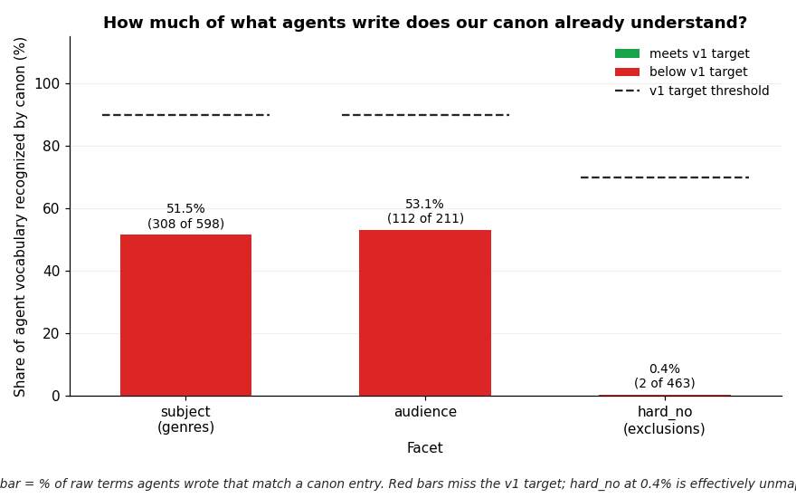
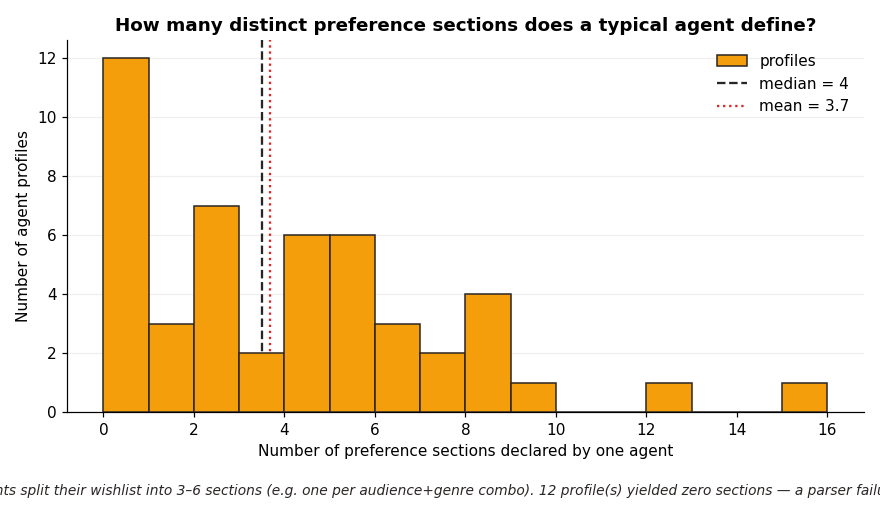
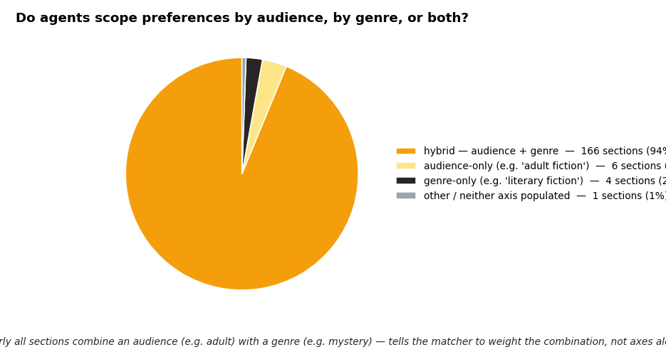
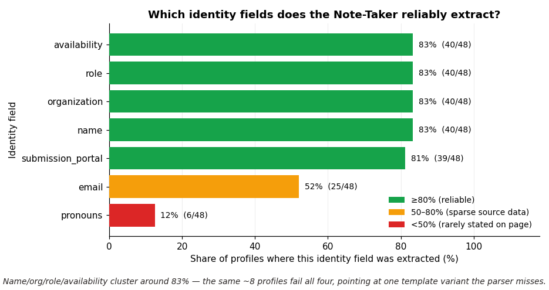
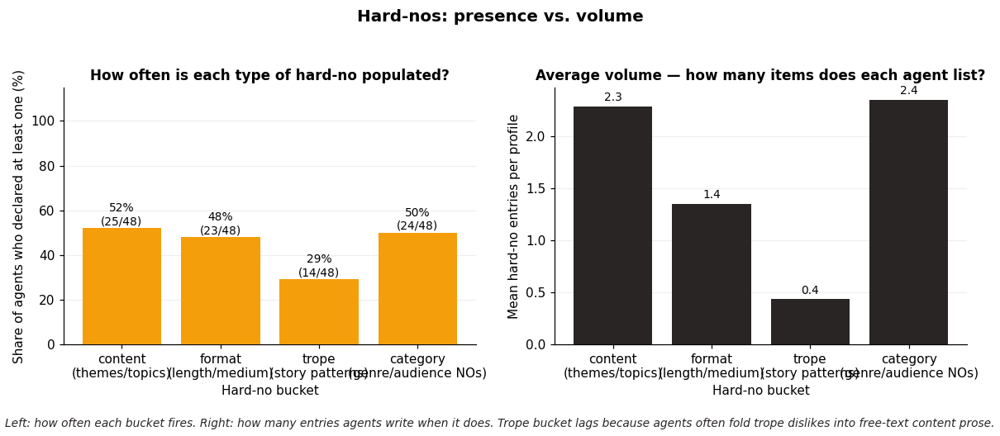
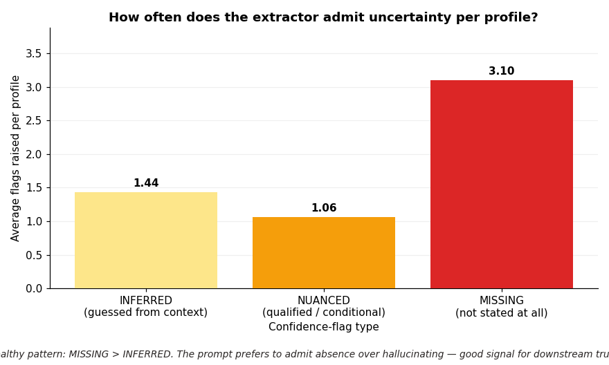
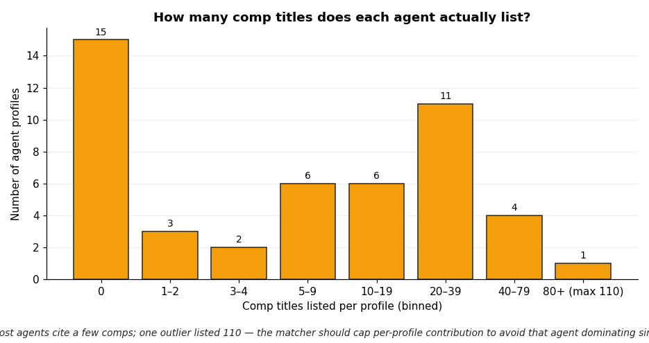
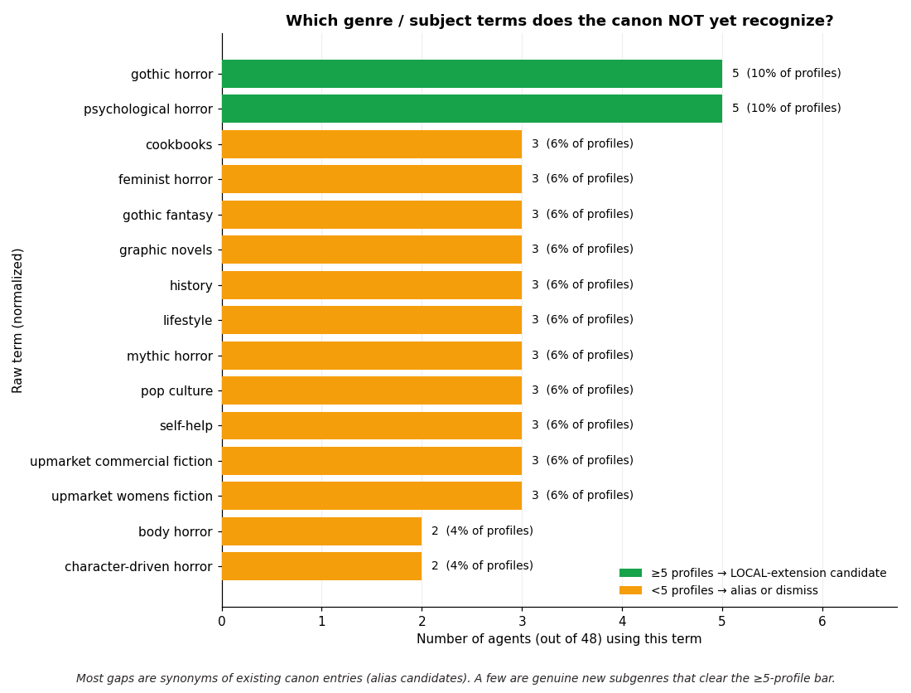
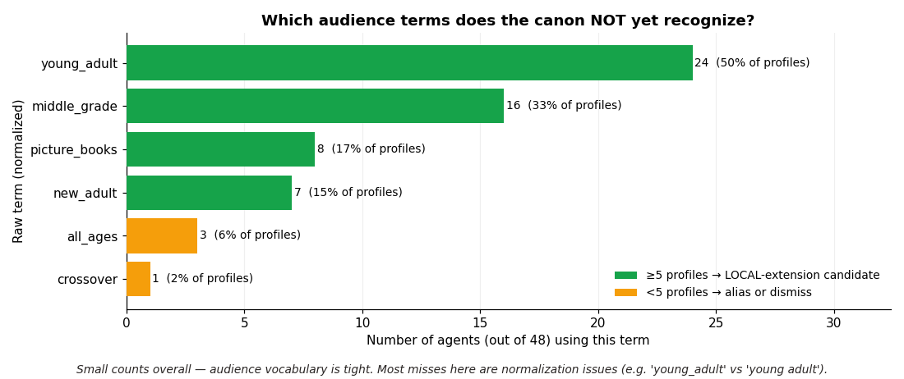
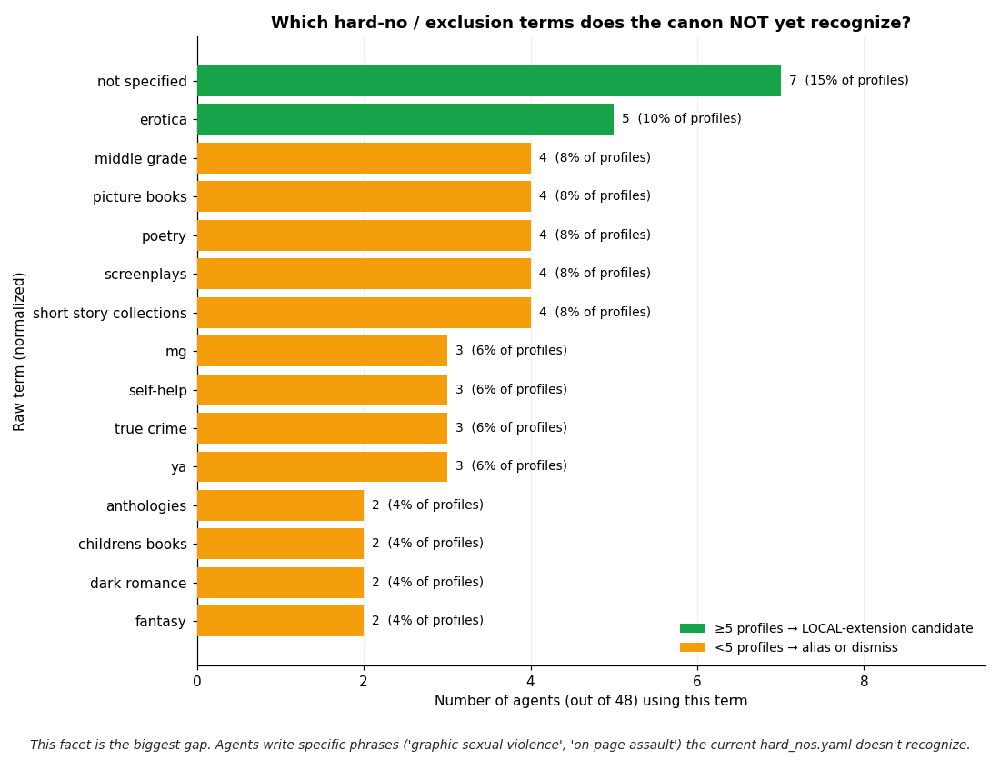

# MSWL Sample — Detailed Analysis (48 profiles)

First-pass deep-dive of 48 ManuscriptWishlist agent profiles captured through
L0→L1 (Note-Taker prompt v2.0, Sonnet 4.5). Nothing in this report is in the
product database — it's internal validation material.

## Headline findings

- **Capture worked.** 48/48 pages fetched, 0 parse failures, median 3.5 preference sections per profile.
- **Canon coverage is well below v1 targets on every facet.** Subject and audience are roughly half-mapped; **hard-no is effectively unmapped at 0.4%** — the vocabulary gap there is the single biggest finding of this run.
- **Identity extraction is noisier than expected.** Only 83% of profiles yielded a name — 8 profiles came back nameless, suggesting either Cloudflare/header stripping or agents whose names aren't in the expected slot.
- **Prompt is self-aware.** Mean 3.1 MISSING flags per profile — the Note-Taker correctly reports what it couldn't find rather than hallucinating. Good news for downstream trust.

## 1 · Canon coverage

| Facet | Mapped | Total | Coverage | v1 target |
|---|---:|---:|---:|---:|
| subject | 308 | 598 | 51.5% | 90% |
| audience | 112 | 211 | 53.1% | 90% |
| hard_no | 2 | 463 | 0.4% | 70% |

**Reading this:** Subject sits at ~52%. Every second genre label agents use has no
home in the current canon. That doesn't mean the canon is half-wrong — most of
the gap is synonyms (`"feminist horror"`, `"upmarket commercial fiction"`) that
need aliasing, not fundamentally new concepts. A small number are genuine category
gaps (horror subgenres).

**Hard-no at 0.4% is the alarm bell.** `hard_nos.yaml` was designed ahead of the
Note-Taker integration; the terms agents actually write ("graphic sexual violence",
"gratuitous gore", "torture porn", "sexual assault on-page") bear almost no
resemblance to the compact tags in that file. This facet needs a rewrite, not patches.

## 2 · Profile structure

- Median 3.5 sections, max 15, 12 profile(s) with zero sections.
- **94% of sections are hybrid** (audience + genre). Agents rarely split preferences on just one axis, which is useful signal for how the matcher should weight section-level features.
- Zero-section profiles: ali-herring, brandy-vallance, daniele-hunter, devin-ross, drew-gilmour, elizabeth-poteet, emelie-burl, kelsey-evans, lee-melillo, madison-hernick, mark-falkin, olivia-liv-turner.

## 3 · Identity completeness

- Name / organization / role / availability cluster at ~83% — the same 8 profiles fail all four, suggesting a systematic parse issue on those pages rather than independent failures.
- **Email only in 52%.** Many agents route through a portal (QueryManager, Submittable) rather than list an address; `submission_portal` at 81% corroborates this.
- Pronouns at 12% — reflects real MSWL profile sparsity, not a parser bug.

## 4 · Hard-nos

- All four buckets fire in 29–52% of profiles.
- The `trope` bucket lags (29%) because many agents fold trope dislikes into `content` prose rather than listing them separately — something the prompt could disambiguate more aggressively.
- Combined with the 0.4% canon-mapping rate above: we have the data, we just can't filter on it yet.

## 5 · Confidence flags

- INFERRED mean 1.4, NUANCED 1.1, MISSING 3.1.
- The MISSING > INFERRED ratio is healthy: the prompt is more willing to admit absence than to guess. That's exactly the behavior we want feeding L2/L3 — it stops downstream layers from building on fabricated signal.

## 6 · Comp titles

- 33/48 profiles list at least one comp, median 7.0, max 110.
- The long tail (one profile with 110) is from an agent who lists favorite books broadly, not per-section comps. Matcher should cap contribution per profile to avoid that one profile dominating similarity scores.

## 7 · Unmapped vocabulary leaderboards

Green bars are LOCAL-extension candidates (≥5 profiles). At 48 profiles that bar is
high — expect more to clear it as the sample grows toward the Step 4 target of 200.

Small absolute counts but 4 of 6 are LOCAL candidates. Audience taxonomy is tight;
the misses here are likely aliasing issues (`"adults"` vs `adult`, `"teens"` vs
`young_adult`) rather than missing categories.

This is the facet that needs most attention — see note in section 1.

## 8 · Immediate action list

1. **Audit `canon/hard_nos.yaml` against the top-50 unmapped hard_no terms.** It's not an alias problem; it's a vocabulary mismatch that needs redesign.
2. **Add aliases** for the obvious token-overlap candidates in subject — low risk, immediate coverage lift. Estimate: +15–20 percentage points with a 60-line edit.
3. **Add LOCAL:gothic_horror and LOCAL:psychological_horror** — both cleared the 5-profile bar.
4. **Investigate the 8 identity-failure profiles.** Same pages, same failure mode → likely a specific template variant the prompt doesn't handle.
5. **Rerun `scripts/canon_dryrun.py`** after aliases/extensions land (no re-crawl needed — it reads cached notes_parsed).
6. **Do not treat this as v1 readiness.** 48 profiles is a diagnostic, not a lock. Step 4's 200-profile production run is still required.

